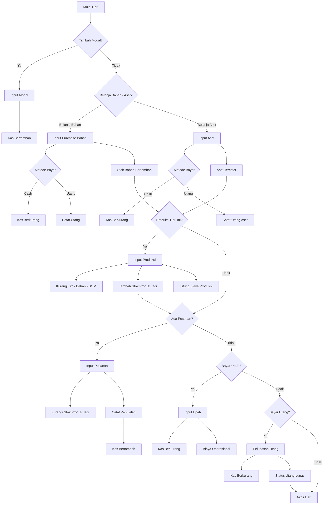
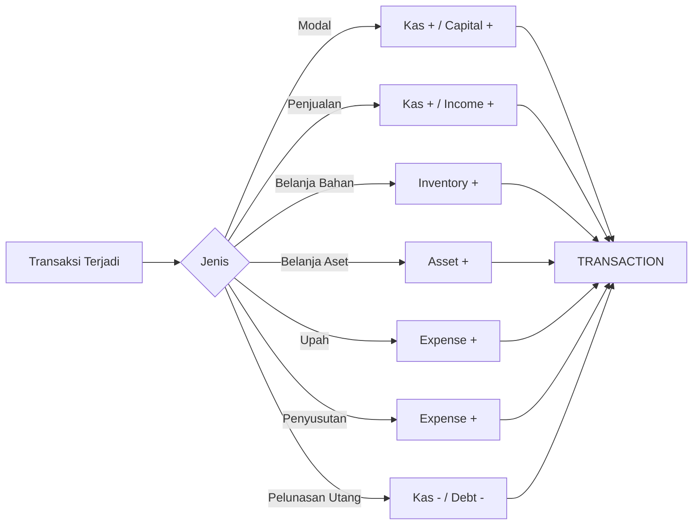
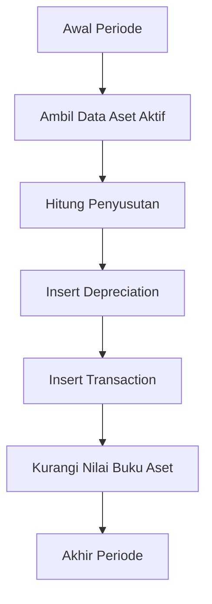
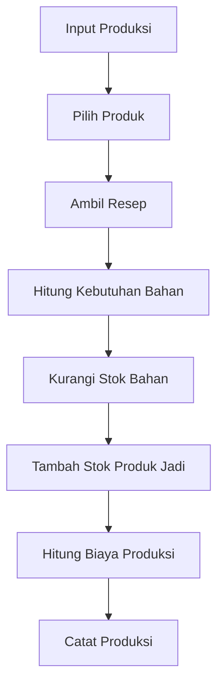
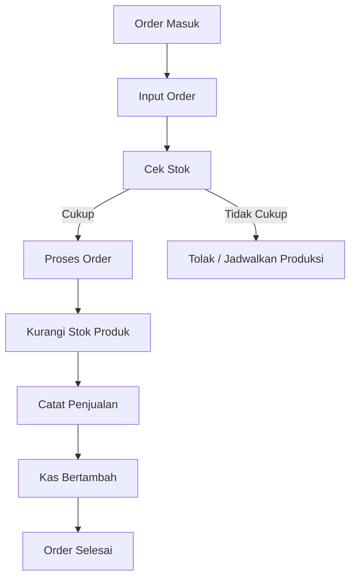

# Sistem Manajemen Usaha Produksi & Penjualan Makanan Ringan

**(Siomay / Dimsum – Web Based)**

---

## 1. Latar Belakang

Usaha kecil produksi makanan rumahan (siomay/dimsum) memiliki karakteristik:

- Produksi harian berbasis pesanan
- Penggunaan bahan baku yang harus terkontrol
- Pencatatan keuangan masih manual
- Tidak ada pemisahan jelas antara:
  - Modal
  - Biaya operasional
  - Utang
  - Aset
  - Keuntungan

Kondisi ini menyulitkan pemilik usaha untuk:

- Mengetahui laba sebenarnya
- Mengontrol stok bahan dan produk jadi
- Menentukan harga jual yang tepat
- Mengambil keputusan pengembangan usaha

---

## 2. Rumusan Masalah

1. Bagaimana mencatat modal usaha tanpa tercampur dengan pendapatan?
2. Bagaimana mengelola stok bahan baku dan produk jadi secara akurat?
3. Bagaimana menghubungkan produksi dengan resep (BOM)?
4. Bagaimana mencatat belanja bahan, belanja aset, dan utang secara terpisah?
5. Bagaimana mencatat upah tenaga kerja sebagai biaya operasional?
6. Bagaimana menghasilkan laporan laba rugi sederhana tanpa akuntansi kompleks?

---

## 3. Tujuan Sistem

- Menyediakan sistem berbasis web untuk UMKM makanan
- Mengintegrasikan:
  - Produksi
  - Penjualan
  - Stok
  - Keuangan
- Menyederhanakan akuntansi tanpa mengorbankan akurasi
- Menjadi dasar pengembangan lanjutan (multi user, laporan lanjutan)

---

## 4. Tech Stack

### Backend

| Komponen | Teknologi | Versi |
|----------|-----------|-------|
| **Framework** | Laravel | 11.x (LTS) |
| **PHP** | PHP | 8.2.29 |
| **Database** | MySQL / MariaDB | 8.0+ / 10.6+ |
| **Authentication** | Laravel Sanctum | Built-in |
| **API** | RESTful API | JSON |

### Frontend

| Komponen | Teknologi | Versi |
|----------|-----------|-------|
| **JavaScript Framework** | Alpine.js | 3.x |
| **CSS Framework** | Tailwind CSS | 3.x |
| **HTTP Client** | Axios | 1.x |
| **Icons** | Heroicons / Lucide | Latest |

### Arsitektur

```
┌─────────────────────────────────────────────────────────────┐
│                        FRONTEND                              │
│  ┌─────────────┐  ┌─────────────┐  ┌─────────────────────┐  │
│  │  Alpine.js  │  │ Tailwind CSS│  │       Axios         │  │
│  │  (Reactive) │  │  (Styling)  │  │  (HTTP Client)      │  │
│  └─────────────┘  └─────────────┘  └─────────────────────┘  │
│                            │                                 │
│                     RESTful API (JSON)                       │
│                            │                                 │
└────────────────────────────┼────────────────────────────────┘
                             │
┌────────────────────────────┼────────────────────────────────┐
│                        BACKEND                               │
│                            ▼                                 │
│  ┌─────────────────────────────────────────────────────┐    │
│  │                   Laravel 11                         │    │
│  │  ┌───────────┐  ┌───────────┐  ┌───────────────┐    │    │
│  │  │ Routes    │  │Controllers│  │   Services    │    │    │
│  │  │ (api.php) │  │ (API)     │  │ (Business)    │    │    │
│  │  └───────────┘  └───────────┘  └───────────────┘    │    │
│  │  ┌───────────┐  ┌───────────┐  ┌───────────────┐    │    │
│  │  │ Models    │  │ Requests  │  │  Resources    │    │    │
│  │  │ (Eloquent)│  │ (Validate)│  │ (Transform)   │    │    │
│  │  └───────────┘  └───────────┘  └───────────────┘    │    │
│  └─────────────────────────────────────────────────────┘    │
│                            │                                 │
│                            ▼                                 │
│  ┌─────────────────────────────────────────────────────┐    │
│  │              MySQL / MariaDB                         │    │
│  └─────────────────────────────────────────────────────┘    │
└─────────────────────────────────────────────────────────────┘
```

### Struktur API Endpoints

```
API Base URL: /api/v1

├── /auth
│   ├── POST   /login          # Login user
│   ├── POST   /logout         # Logout user
│   └── GET    /me             # Get current user
│
├── /master
│   ├── /products              # CRUD Products
│   ├── /materials             # CRUD Materials
│   ├── /customers             # CRUD Customers
│   ├── /suppliers             # CRUD Suppliers
│   ├── /employees             # CRUD Employees
│   ├── /accounts              # CRUD Chart of Account
│   ├── /payment-methods       # CRUD Payment Methods
│   └── /units                 # CRUD Unit of Measure
│
├── /inventory
│   ├── /material-stocks       # Material stock management
│   ├── /product-stocks        # Product stock management
│   └── /stock-opnames         # Stock adjustment
│
├── /production
│   ├── /recipes               # CRUD Recipes (BOM)
│   └── /productions           # CRUD Production records
│
├── /purchase
│   └── /purchases             # CRUD Purchase records
│
├── /sales
│   └── /orders                # CRUD Sales orders
│
├── /finance
│   ├── /transactions          # View transactions
│   ├── /capitals              # CRUD Capital injection
│   ├── /wages                 # CRUD Wages
│   ├── /debts                 # View & manage debts
│   └── /debt-payments         # CRUD Debt payments
│
├── /asset
│   ├── /assets                # CRUD Assets
│   └── /depreciations         # View depreciations
│
└── /reports
    ├── /profit-loss           # Profit & Loss report
    ├── /stock-report          # Stock summary
    └── /sales-report          # Sales summary
```

### Response Format (JSON)

```json
// Success Response
{
  "success": true,
  "message": "Data retrieved successfully",
  "data": { ... },
  "meta": {
    "current_page": 1,
    "per_page": 15,
    "total": 100
  }
}

// Error Response
{
  "success": false,
  "message": "Validation failed",
  "errors": {
    "name": ["The name field is required."]
  }
}
```

---

## 5. Workflow Utama Operasional Harian (End-to-End)



---

## 6. Workflow Keuangan (Ledger-Centric)



---

## 7. Workflow Penyusutan Aset (Bulanan / Otomatis)



---

## 8. Workflow Produksi Berbasis Resep (BOM)



---

## 9. Workflow Penjualan Sederhana (UMKM Friendly)



---

## 10. Prinsip Desain Workflow

- User tidak melihat akuntansi, hanya form sederhana
- Sistem otomatis:
  - Mengatur stok
  - Membuat transaksi
  - Menghitung laba
- Semua jalur berakhir ke TRANSACTION

---

## 11. Conceptual Data Model (CDM)

```mermaid
erDiagram
    %% ======================
    %% CORE ACTORS
    %% ======================
    USER ||--o{ ORDER : creates
    CUSTOMER ||--o{ ORDER : places
    EMPLOYEE ||--o{ WAGE : receives
    SUPPLIER ||--o{ PURCHASE : supplies

    %% ======================
    %% MASTER DATA
    %% ======================
    MATERIAL_CATEGORY ||--o{ MATERIAL : categorizes
    UNIT_OF_MEASURE ||--o{ MATERIAL : uses
    PAYMENT_METHOD ||--o{ PURCHASE : paid_via
    PAYMENT_METHOD ||--o{ ORDER : paid_via

    %% ======================
    %% SALES
    %% ======================
    ORDER ||--|{ ORDER_ITEM : contains
    PRODUCT ||--o{ ORDER_ITEM : sold_as

    %% ======================
    %% PRODUCTION & INVENTORY
    %% ======================
    PRODUCT ||--o{ RECIPE : has
    RECIPE ||--|{ RECIPE_ITEM : consists_of
    MATERIAL ||--o{ RECIPE_ITEM : used_in

    MATERIAL ||--o{ MATERIAL_STOCK : tracked_in
    PRODUCT ||--o{ PRODUCT_STOCK : tracked_in

    PRODUCTION ||--|{ PRODUCTION_ITEM : produces
    PRODUCT ||--o{ PRODUCTION_ITEM : produced_as

    %% ======================
    %% STOCK ADJUSTMENT
    %% ======================
    MATERIAL ||--o{ STOCK_OPNAME : adjusted_in
    PRODUCT ||--o{ STOCK_OPNAME : adjusted_in

    %% ======================
    %% PURCHASE
    %% ======================
    PURCHASE ||--|{ PURCHASE_ITEM : includes
    MATERIAL ||--o{ PURCHASE_ITEM : purchased

    %% ======================
    %% FINANCIAL CORE
    %% ======================
    ACCOUNT ||--o{ TRANSACTION_LINE : uses
    TRANSACTION ||--|{ TRANSACTION_LINE : has

    PURCHASE ||--o{ TRANSACTION : generates
    ORDER ||--o{ TRANSACTION : generates
    WAGE ||--o{ TRANSACTION : generates
    ASSET ||--o{ TRANSACTION : generates
    CAPITAL ||--o{ TRANSACTION : generates
    DEPRECIATION ||--o{ TRANSACTION : generates

    %% ======================
    %% DEBT
    %% ======================
    PURCHASE ||--o{ DEBT : creates
    ASSET ||--o{ DEBT : creates
    DEBT ||--o{ DEBT_PAYMENT : settled_by

    %% ======================
    %% ASSET
    %% ======================
    ASSET ||--o{ DEPRECIATION : has

    %% ======================
    %% ENTITIES - MASTER DATA
    %% ======================
    MATERIAL_CATEGORY {
        int id PK
        string name
        string description
        timestamp created_at
        timestamp updated_at
    }

    UNIT_OF_MEASURE {
        int id PK
        string name
        string symbol
        timestamp created_at
        timestamp updated_at
    }

    PAYMENT_METHOD {
        int id PK
        string name
        string type "cash, transfer, ewallet"
        boolean is_active
        timestamp created_at
        timestamp updated_at
    }

    ACCOUNT {
        int id PK
        string code
        string name
        string type "kas, bank, piutang, utang, modal, pendapatan, beban"
        decimal balance
        boolean is_active
        timestamp created_at
        timestamp updated_at
    }

    %% ======================
    %% ENTITIES - CORE ACTORS
    %% ======================
    USER {
        int id PK
        string name
        string email
        string role
        timestamp created_at
        timestamp updated_at
    }

    CUSTOMER {
        int id PK
        string name
        string phone
        string address
        timestamp created_at
        timestamp updated_at
    }

    EMPLOYEE {
        int id PK
        string name
        string phone
        string position
        timestamp created_at
        timestamp updated_at
    }

    SUPPLIER {
        int id PK
        string name
        string phone
        string address
        timestamp created_at
        timestamp updated_at
    }

    %% ======================
    %% ENTITIES - PRODUCT & MATERIAL
    %% ======================
    PRODUCT {
        int id PK
        string name
        string sku
        decimal price
        string category
        timestamp created_at
        timestamp updated_at
    }

    MATERIAL {
        int id PK
        int category_id FK
        int unit_id FK
        string name
        string unit
        decimal min_stock
        date expiry_date
        timestamp created_at
        timestamp updated_at
    }

    %% ======================
    %% ENTITIES - SALES
    %% ======================
    ORDER {
        int id PK
        int customer_id FK
        int user_id FK
        int payment_method_id FK
        string order_number
        date order_date
        decimal subtotal
        decimal discount
        decimal delivery_fee
        decimal total
        string payment_status "unpaid, partial, paid"
        string status "pending, processing, completed, cancelled"
        timestamp created_at
        timestamp updated_at
    }

    ORDER_ITEM {
        int id PK
        int order_id FK
        int product_id FK
        int qty
        decimal price
        decimal discount
        decimal subtotal
        timestamp created_at
        timestamp updated_at
    }

    %% ======================
    %% ENTITIES - RECIPE & PRODUCTION
    %% ======================
    RECIPE {
        int id PK
        int product_id FK
        string name
        int output_qty
        timestamp created_at
        timestamp updated_at
    }

    RECIPE_ITEM {
        int id PK
        int recipe_id FK
        int material_id FK
        decimal quantity
        timestamp created_at
        timestamp updated_at
    }

    PRODUCTION {
        int id PK
        int user_id FK
        string production_number
        date production_date
        string status "draft, in_progress, completed, cancelled"
        text notes
        timestamp created_at
        timestamp updated_at
    }

    PRODUCTION_ITEM {
        int id PK
        int production_id FK
        int product_id FK
        int recipe_id FK
        int quantity
        decimal cost
        timestamp created_at
        timestamp updated_at
    }

    %% ======================
    %% ENTITIES - INVENTORY
    %% ======================
    MATERIAL_STOCK {
        int id PK
        int material_id FK
        decimal quantity
        decimal avg_cost
        timestamp created_at
        timestamp updated_at
    }

    PRODUCT_STOCK {
        int id PK
        int product_id FK
        decimal quantity
        decimal avg_cost
        timestamp created_at
        timestamp updated_at
    }

    STOCK_OPNAME {
        int id PK
        int user_id FK
        string type "material, product"
        int reference_id
        decimal system_qty
        decimal actual_qty
        decimal difference
        string reason
        date opname_date
        timestamp created_at
        timestamp updated_at
    }

    %% ======================
    %% ENTITIES - PURCHASE
    %% ======================
    PURCHASE {
        int id PK
        int supplier_id FK
        int user_id FK
        int payment_method_id FK
        string purchase_number
        date purchase_date
        decimal total
        string payment_type "cash, credit"
        timestamp created_at
        timestamp updated_at
    }

    PURCHASE_ITEM {
        int id PK
        int purchase_id FK
        int material_id FK
        decimal quantity
        decimal price
        decimal subtotal
        date expiry_date
        timestamp created_at
        timestamp updated_at
    }

    %% ======================
    %% ENTITIES - FINANCIAL
    %% ======================
    TRANSACTION {
        int id PK
        int user_id FK
        string transaction_number
        date transaction_date
        string type "capital, sale, purchase, wage, depreciation, debt_payment, adjustment"
        decimal total_amount
        string reference_type
        int reference_id
        text description
        timestamp created_at
        timestamp updated_at
    }

    TRANSACTION_LINE {
        int id PK
        int transaction_id FK
        int account_id FK
        string account_type
        decimal amount
        string direction "debit, credit"
        timestamp created_at
        timestamp updated_at
    }

    CAPITAL {
        int id PK
        int user_id FK
        date capital_date
        decimal amount
        string source
        text description
        timestamp created_at
        timestamp updated_at
    }

    %% ======================
    %% ENTITIES - DEBT
    %% ======================
    DEBT {
        int id PK
        int supplier_id FK
        string debt_type "purchase, asset"
        string reference_type
        int reference_id
        date debt_date
        decimal amount
        decimal paid_amount
        decimal remaining_amount
        date due_date
        string status "unpaid, partial, paid"
        timestamp created_at
        timestamp updated_at
    }

    DEBT_PAYMENT {
        int id PK
        int debt_id FK
        int user_id FK
        int payment_method_id FK
        date payment_date
        decimal amount
        text notes
        timestamp created_at
        timestamp updated_at
    }

    %% ======================
    %% ENTITIES - WAGE
    %% ======================
    WAGE {
        int id PK
        int employee_id FK
        int user_id FK
        int payment_method_id FK
        date wage_date
        decimal amount
        string wage_type "daily, weekly, monthly, bonus"
        string payment_status "unpaid, paid"
        text notes
        timestamp created_at
        timestamp updated_at
    }

    %% ======================
    %% ENTITIES - ASSET
    %% ======================
    ASSET {
        int id PK
        int user_id FK
        string name
        string asset_number
        date purchase_date
        decimal purchase_price
        int useful_life_month
        decimal residual_value
        decimal book_value
        string payment_type "cash, credit"
        string status "active, disposed, fully_depreciated"
        timestamp created_at
        timestamp updated_at
    }

    DEPRECIATION {
        int id PK
        int asset_id FK
        date period
        decimal amount
        decimal accumulated
        decimal book_value_after
        timestamp created_at
        timestamp updated_at
    }
```



---

## 12. Prinsip Desain Sistem

- Ledger sederhana sebagai pusat keuangan
- User tidak berinteraksi dengan istilah akuntansi rumit
- Setiap aktivitas menghasilkan TRANSACTION
- Aset tidak langsung menjadi biaya
- Biaya produksi dihitung dari BOM
- Cocok untuk UMKM dan scalable
- Audit trail tersedia di setiap tabel (`created_at`, `updated_at`)

---

## 13. Ruang Pengembangan Lanjutan

| Prioritas | Fitur | Keterangan |
|-----------|-------|------------|
| Tinggi | Laporan laba rugi per produk | Analisis profitabilitas |
| Tinggi | Multi user & role | Admin, Kasir, Produksi |
| Sedang | Integrasi marketplace | Tokopedia, Shopee, GoFood |
| Sedang | Export laporan (PDF/Excel) | Laporan keuangan, stok |
| Sedang | Notifikasi stok minimum | Alert saat stok menipis |
| Rendah | Multi-kas/rekening | Kas Toko, Bank, E-Wallet |
| Rendah | HPP detail per produksi | Termasuk biaya tenaga kerja & overhead |
| Rendah | Dashboard analytics | Grafik penjualan, tren produksi |

---

## 14. Rekomendasi Prioritas Implementasi

| Fase | Fokus | Entitas Utama |
|------|-------|---------------|
| **1** | Master Data | Product, Material, Customer, Supplier, User, Account |
| **2** | Inventory & Purchase | Material Stock, Purchase, Purchase Item |
| **3** | Production | Recipe, Production, Product Stock |
| **4** | Sales | Order, Order Item |
| **5** | Finance | Transaction, Capital, Wage, Debt |
| **6** | Asset & Depreciation | Asset, Depreciation |

---

## 15. Penutup

Dokumen ini menjadi baseline desain sistem yang:

- ✅ Siap diturunkan ke database (PDM)
- ✅ Siap diimplementasikan ke backend API
- ✅ Mudah dikembangkan secara bertahap
- ✅ Mendukung audit trail
- ✅ Scalable untuk pengembangan masa depan